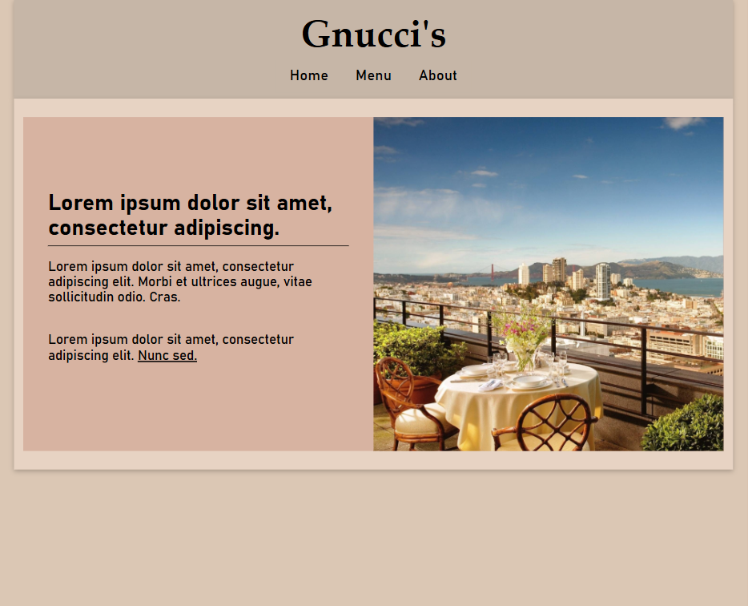

# Gnucci's

A simple restaurant website mockup built as part of **The Odin Project** curriculum.

The project focuses on practicing JavaScript modules, DOM manipulation, and bundling tools by generating **the entire website interface dynamically through JavaScript** rather than relying on static HTML content.

